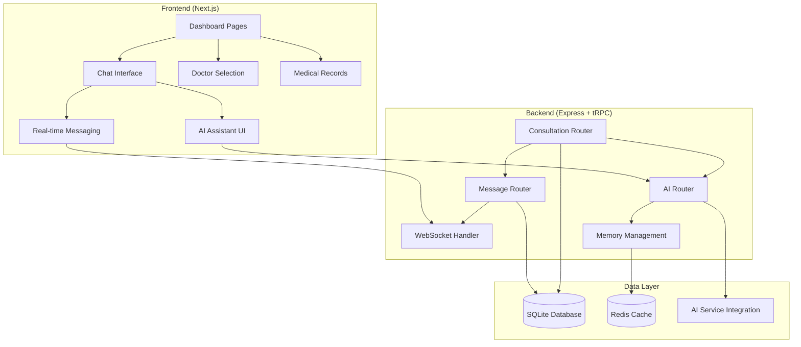

# Design Document

## Overview

The healthcare consultation platform design implements a secure, real-time communication system between doctors and patients with AI assistance. The architecture leverages the existing Next.js frontend, Express/tRPC backend, and SQLite database, extending it with consultation management, real-time messaging, and AI integration capabilities.

## Architecture

### High-Level Architecture



### Technology Stack Integration

- **Frontend**: Next.js 15 with App Router, React 19, TailwindCSS, shadcn/ui
- **Backend**: Express 5, tRPC 11, WebSocket support for real-time messaging
- **Database**: SQLite with Drizzle ORM for primary data, Redis for AI memory caching
- **AI Integration**: Google Gemini via AI SDK for assistant functionality
- **Authentication**: Better Auth with existing role-based access control

## Components and Interfaces

### Database Schema Extensions

#### Consultations Table
```typescript
export const consultation = sqliteTable("consultation", {
  id: text("id").primaryKey(),
  patientId: text("patient_id").notNull().references(() => user.id),
  doctorId: text("doctor_id").references(() => user.id),
  title: text("title").notNull(),
  description: text("description").notNull(),
  status: text("status", { enum: ["pending", "active", "inactive"] }).default("pending"),
  createdAt: integer("created_at", { mode: "timestamp" }).notNull(),
  updatedAt: integer("updated_at", { mode: "timestamp" }).notNull(),
});
```

#### Messages Table
```typescript
export const message = sqliteTable("message", {
  id: text("id").primaryKey(),
  consultationId: text("consultation_id").notNull().references(() => consultation.id),
  senderId: text("sender_id").notNull().references(() => user.id),
  content: text("content").notNull(),
  messageType: text("message_type", { enum: ["user", "ai"] }).default("user"),
  createdAt: integer("created_at", { mode: "timestamp" }).notNull(),
});
```

#### AI Memories (Redis)
```typescript
interface AIMemory {
  consultationId: string;
  key: string;
  value: string;
  createdBy: string; // doctor ID
  createdAt: Date;
}
```

### API Router Structure

#### Consultation Router
```typescript
export const consultationRouter = router({
  // Patient operations
  create: protectedProcedure.input(createConsultationSchema).mutation(),
  getMyConsultations: protectedProcedure.query(),
  
  // Doctor operations
  getPendingConsultations: protectedProcedure.query(),
  getActiveConsultations: protectedProcedure.query(),
  acceptConsultation: protectedProcedure.input(z.object({ id: z.string() })).mutation(),
  rejectConsultation: protectedProcedure.input(z.object({ id: z.string() })).mutation(),
  endConsultation: protectedProcedure.input(z.object({ id: z.string() })).mutation(),
  
  // Shared operations
  getConsultationById: protectedProcedure.input(z.object({ id: z.string() })).query(),
});
```

#### Message Router
```typescript
export const messageRouter = router({
  getMessages: protectedProcedure.input(z.object({ consultationId: z.string() })).query(),
  sendMessage: protectedProcedure.input(sendMessageSchema).mutation(),
  subscribeToMessages: protectedProcedure.input(z.object({ consultationId: z.string() })).subscription(),
});
```

#### AI Router
```typescript
export const aiRouter = router({
  processAIRequest: protectedProcedure.input(aiRequestSchema).mutation(),
  getMemories: protectedProcedure.input(z.object({ consultationId: z.string() })).query(),
  createMemory: protectedProcedure.input(createMemorySchema).mutation(),
});
```

### Frontend Component Architecture

#### Page Components
- **Dashboard**: Role-specific dashboard with consultation lists
- **Chat Interface**: Real-time messaging with AI integration
- **Doctor Selection**: Doctor browsing and consultation creation
- **Medical Records**: Patient consultation history

#### Shared Components
- **ConsultationCard**: Displays consultation information with status
- **MessageBubble**: Individual message display with sender identification
- **AIAssistant**: AI interaction interface with @b mention handling
- **ConsultationSidebar**: Dynamic sidebar showing relevant consultations

### Real-time Communication

#### WebSocket Integration
```typescript
// WebSocket event types
interface WebSocketEvents {
  'message:new': { consultationId: string; message: Message };
  'consultation:status': { consultationId: string; status: ConsultationStatus };
  'user:online': { userId: string; consultationId: string };
  'user:offline': { userId: string; consultationId: string };
}
```

#### Message Flow
1. User sends message via tRPC mutation
2. Message stored in database
3. WebSocket broadcasts message to consultation participants
4. AI processing triggered if @b mention detected
5. AI response stored and broadcasted

## Data Models

### Core Entities

#### Consultation Entity
```typescript
interface Consultation {
  id: string;
  patientId: string;
  doctorId?: string;
  title: string;
  description: string;
  status: 'pending' | 'active' | 'inactive';
  createdAt: Date;
  updatedAt: Date;
  
  // Relations
  patient: User;
  doctor?: User;
  messages: Message[];
}
```

#### Message Entity
```typescript
interface Message {
  id: string;
  consultationId: string;
  senderId: string;
  content: string;
  messageType: 'user' | 'ai';
  createdAt: Date;
  
  // Relations
  sender: User;
  consultation: Consultation;
}
```

#### AI Memory Entity
```typescript
interface AIMemory {
  consultationId: string;
  key: string;
  value: string;
  createdBy: string;
  createdAt: Date;
}
```

### Data Access Patterns

#### Role-based Access Control
- **Patients**: Full access to their own consultations (all statuses)
- **Doctors**: Access to assigned consultations (pending/active only)
- **AI Memories**: Doctors can create, both roles can read within consultation scope

#### Query Optimization
- Index on consultation status and user relationships
- Pagination for message history
- Caching for frequently accessed consultation data

## Error Handling

### API Error Responses
```typescript
enum ConsultationErrors {
  CONSULTATION_NOT_FOUND = 'CONSULTATION_NOT_FOUND',
  UNAUTHORIZED_ACCESS = 'UNAUTHORIZED_ACCESS',
  INVALID_STATUS_TRANSITION = 'INVALID_STATUS_TRANSITION',
  DOCTOR_ALREADY_ASSIGNED = 'DOCTOR_ALREADY_ASSIGNED',
  CONSULTATION_ENDED = 'CONSULTATION_ENDED',
}
```

### Frontend Error Handling
- Toast notifications for user-facing errors
- Retry mechanisms for network failures
- Graceful degradation for real-time features
- Error boundaries for component-level failures

### WebSocket Error Handling
- Automatic reconnection with exponential backoff
- Message queuing during disconnection
- Fallback to polling for critical updates

## Testing Strategy

### Unit Testing
- **Database Operations**: Test all CRUD operations with mock data
- **Business Logic**: Test consultation state transitions and access control
- **AI Integration**: Mock AI responses and test memory management
- **Validation**: Test input schemas and data validation

### Integration Testing
- **API Endpoints**: Test complete request/response cycles
- **WebSocket Communication**: Test real-time message delivery
- **Authentication Flow**: Test role-based access control
- **Database Transactions**: Test data consistency across operations

### End-to-End Testing
- **Patient Journey**: Create consultation → select doctor → chat → view records
- **Doctor Journey**: Accept consultation → chat → end consultation
- **AI Interaction**: Test @b mentions and memory creation/retrieval
- **Real-time Features**: Test concurrent user interactions

### Performance Testing
- **Database Queries**: Test query performance with large datasets
- **WebSocket Scalability**: Test concurrent connection limits
- **AI Response Times**: Test AI processing latency
- **Memory Usage**: Test Redis memory consumption patterns

## Security Considerations

### Data Protection
- Encrypt sensitive medical data at rest
- Use HTTPS for all communications
- Implement proper session management
- Sanitize user inputs to prevent XSS

### Access Control
- Validate user permissions on every request
- Implement consultation-scoped access control
- Audit log for sensitive operations
- Rate limiting for AI requests

### Privacy Compliance
- Implement data retention policies
- Provide data export capabilities
- Support consultation data deletion (where legally permitted)
- Maintain audit trails for compliance

## AI Integration Architecture

### Memory Management
- Redis-based key-value storage scoped to consultations
- Doctor-only write access for creating memories
- Both roles read access within consultation scope
- Automatic cleanup of inactive consultation memories

### AI Processing Pipeline
1. Detect @b mentions in chat messages
2. Determine request type (statement vs. question)
3. For statements: Create memory + generate response
4. For questions: Query memories + generate contextual response
5. Store AI response as system message
6. Broadcast response to all participants

### Integration Points
- Google Gemini API for natural language processing
- Context injection with consultation-specific memories
- Response formatting for medical consultation context
- Error handling for AI service unavailability