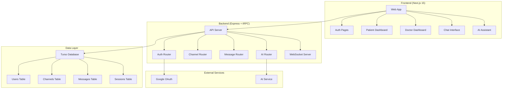

# Design Document

## Overview

The healthcare consultation platform follows a ChatGPT-inspired interface design adapted for medical consultations. The system uses a clean, conversational UI with a left sidebar for channel navigation and a main chat area for real-time communication between patients and doctors, enhanced with AI assistance.

## Architecture

### System Architecture



### Technology Stack

- **Frontend**: Next.js 15 with React 19, shadcn/ui components
- **Backend**: Express 5 with tRPC 11 for type-safe APIs
- **Database**: Drizzle ORM with Turso (SQLite)
- **Authentication**: Better-Auth with Google OAuth
- **Real-time**: WebSocket integration
- **AI**: AI SDK with Google Gemini
- **Styling**: TailwindCSS 4 with shadcn/ui (no custom styling)

## Components and Interfaces

### UI Component Structure

#### ChatGPT-Inspired Layout
```
┌─────────────────────────────────────────────────────────┐
│ Header (Logo, User Menu, Logout)                        │
├─────────────┬───────────────────────────────────────────┤
│             │                                           │
│  Sidebar    │           Main Chat Area                  │
│             │                                           │
│ - New Chat  │  ┌─────────────────────────────────────┐  │
│ - Channels  │  │                                     │  │
│   • Active  │  │        Message History              │  │
│   • Past    │  │                                     │  │
│             │  │                                     │  │
│             │  └─────────────────────────────────────┘  │
│             │  ┌─────────────────────────────────────┐  │
│             │  │ Message Input + AI Assistant        │  │
│             │  └─────────────────────────────────────┘  │
└─────────────┴───────────────────────────────────────────┘
```

#### Core Components

**1. Layout Components**
- `AppLayout`: Main application wrapper with sidebar and content area
- `Sidebar`: Collapsible navigation with channel list
- `Header`: Top navigation with user info and actions

**2. Authentication Components**
- `LoginPage`: Google OAuth integration
- `RoleSelection`: Post-auth role picker (Patient/Doctor)
- `AuthGuard`: Route protection wrapper

**3. Dashboard Components**
- `PatientDashboard`: Channel management for patients
- `DoctorDashboard`: Available channels for doctors
- `ChannelList`: Sidebar channel navigation
- `NewChannelDialog`: Channel creation modal

**4. Chat Components**
- `ChatInterface`: Main conversation area
- `MessageList`: Scrollable message history
- `MessageInput`: Text input with send functionality
- `MessageBubble`: Individual message display
- `AIAssistant`: Integrated AI helper panel## D
ata Models

### Database Schema

#### Users Table
```typescript
interface User {
  id: string;
  email: string;
  name: string;
  role: 'patient' | 'doctor' | null;
  avatar?: string;
  createdAt: Date;
  updatedAt: Date;
}
```

#### Channels Table
```typescript
interface Channel {
  id: string;
  title: string;
  description?: string;
  patientId: string;
  status: 'waiting' | 'active' | 'ended';
  createdAt: Date;
  updatedAt: Date;
}
```

#### Sessions Table
```typescript
interface Session {
  id: string;
  channelId: string;
  doctorId: string;
  startedAt: Date;
  endedAt?: Date;
  status: 'active' | 'ended';
}
```

#### Messages Table
```typescript
interface Message {
  id: string;
  channelId: string;
  senderId: string;
  content: string;
  type: 'user' | 'ai';
  timestamp: Date;
}
```

### API Interfaces

#### tRPC Router Structure
```typescript
// Auth Router
interface AuthRouter {
  getSession(): Promise<User | null>;
  updateRole(role: 'patient' | 'doctor'): Promise<User>;
}

// Channel Router
interface ChannelRouter {
  create(data: { title: string; description?: string }): Promise<Channel>;
  getMyChannels(): Promise<Channel[]>;
  getAvailableChannels(): Promise<Channel[]>; // For doctors
  joinChannel(channelId: string): Promise<Session>;
  endSession(sessionId: string): Promise<void>;
}

// Message Router
interface MessageRouter {
  getMessages(channelId: string): Promise<Message[]>;
  sendMessage(data: { channelId: string; content: string }): Promise<Message>;
}

// AI Router
interface AIRouter {
  summarizeConversation(channelId: string): Promise<string>;
  askQuestion(channelId: string, question: string): Promise<string>;
}
```

## Error Handling

### Frontend Error Boundaries
- Global error boundary for unhandled React errors
- Form validation with shadcn/ui form components
- Loading states for all async operations
- Toast notifications for user feedback

### Backend Error Handling
- tRPC error handling with proper HTTP status codes
- Database connection error recovery
- WebSocket connection management
- Rate limiting for API endpoints

### Error Types
```typescript
enum ErrorCode {
  UNAUTHORIZED = 'UNAUTHORIZED',
  CHANNEL_NOT_FOUND = 'CHANNEL_NOT_FOUND',
  SESSION_ALREADY_ACTIVE = 'SESSION_ALREADY_ACTIVE',
  INVALID_ROLE = 'INVALID_ROLE',
  AI_SERVICE_ERROR = 'AI_SERVICE_ERROR'
}
```

## Testing Strategy

### Unit Testing
- Component testing with React Testing Library
- API route testing with Jest
- Database model testing with test database
- Utility function testing

### Integration Testing
- End-to-end user flows with Playwright
- WebSocket connection testing
- Authentication flow testing
- Real-time message delivery testing

### Test Coverage Areas
- User registration and role selection
- Channel creation and management
- Doctor-patient matching
- Real-time messaging
- AI assistant functionality
- Session management and transitions## UI/UX
 Design Specifications

### ChatGPT-Inspired Interface Adaptations

#### Sidebar Design (shadcn/ui components)
- **New Channel Button**: Prominent "+" button at top of sidebar
- **Channel List**: Scrollable list with channel titles and status indicators
- **Channel Categories**: 
  - "Active Consultations" (green indicator)
  - "Waiting for Doctor" (yellow indicator) 
  - "Past Consultations" (gray indicator)
- **Search/Filter**: Quick search for channel titles
- **Collapsible**: Mobile-responsive sidebar that can collapse

#### Main Chat Area
- **Message Display**: 
  - Patient messages: Right-aligned, blue background
  - Doctor messages: Left-aligned, white background with border
  - AI messages: Left-aligned, purple accent with AI icon
  - Timestamps on hover
- **Message Input**: 
  - Multi-line text area with auto-resize
  - Send button (Enter key support)
  - AI assistant toggle button
- **Status Indicators**:
  - "Doctor is typing..." indicators
  - Connection status (online/offline)
  - Session status (active/waiting/ended)

#### Role-Specific Adaptations

**Patient Interface**:
- Sidebar shows "My Health Issues" as header
- "Start New Consultation" button prominently displayed
- Channel status clearly indicated (waiting, active, completed)
- Option to "Request New Doctor" for ended sessions

**Doctor Interface**:
- Sidebar shows "Available Patients" and "My Active Consultations"
- Patient information preview on channel hover
- "Join Consultation" on click
- "End Session" button (only for doctors)

### Component Styling Guidelines

#### Color Scheme (TailwindCSS classes)
use the shadcn default

### Responsive Design

#### Desktop (1024px+)
- Full sidebar visible (280px width)
- Three-column layout possible for doctor dashboard
- Larger message bubbles with more padding

#### Tablet (768px - 1023px)
- Collapsible sidebar (overlay mode)
- Two-column layout
- Touch-friendly button sizes

#### Mobile (< 768px)
- Hidden sidebar (hamburger menu)
- Single column layout
- Bottom-fixed message input
- Swipe gestures for navigation

### Accessibility Features

- **Screen Reader**: Proper ARIA labels and semantic HTML

### Animation and Transitions

- **Loading States**: Skeleton loaders for message history
- **Status Changes**: Subtle color transitions for status updates
